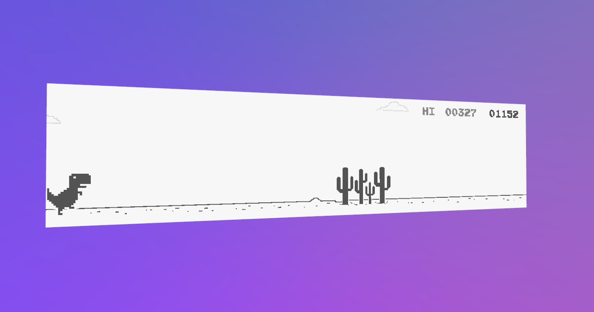

# TSL Dino Game

<div align="center">


  <p><em>A recreation of Chrome's T-Rex game using Three.js WebGPU and TSL (Three.js Shading Language).</em></p>

[](https://www.typescriptlang.org/)
[](https://threejs.org/)
[](https://vitejs.dev/)
[](https://developer.mozilla.org/en-US/docs/Web/API/WebGPU_API)
</div>

## 🤨 Why?
This game is based on the original Chromium T-Rex game, check
out the [source code](https://github.com/chromium/chromium/tree/main/components/neterror/resources/dino_game).

The goal was to see how much of the original game could be recreated using shaders only.

Everything you see - the T-Rex, cacti, pterodactyls, ground, clouds, even the score - is rendered in a single fragment
shader using [TSL](https://github.com/mrdoob/three.js/wiki/Three.js-Shading-Language). Even collisions are detected in
the shader and read back to the CPU.

## 🚀 Getting Started

```bash
npm install
npm run dev
```

Then open `http://localhost:5173` to play the game.

### Debug Mode

Add `?debug` to the URL to enable:

- dat.GUI controls for tweaking game/shader parameters
- view collision detection redback

## 🎮 Game Controls

- `Space` or `↑` to jump (tap on mobile)
- `↓` to duck while running
- `Space` to restart after game over

Avoid the cacti and pterodactyls. The game gets faster as you go. Your high score is saved locally.

## 🏗️ Project Structure

```
src/
├── tsl/                         # TSL shader modules
│   ├── fragmentShader.ts        # Main fragment shader composition
│   ├── sdf2d.ts                 # 2D sdf functions
│   ├── tslTRex.ts               # T-Rex character rendering
│   ├── tslCactus.ts             # Cactus obstacle rendering
│   ├── tslPterodactyl.ts        # Flying obstacle rendering
│   ├── tslBackground.ts         # Ground and horizon rendering
│   ├── tslScore.ts              # Score display rendering
│   ├── tslMoon.ts               # Moon and night sky
│   ├── tslStars.ts              # Starfield rendering
│   ├── tslCloud.ts              # Cloud animations
│   └── tslSpriteUtils.ts        # Sprite extraction utilities
├── collisionDetection.ts        # readBack detected collisions to CPU
├── tRexControls.ts              # Input handling and T-Rex state
├── cameraAnimation.ts           # Responsive camera positioning
├── soundPlayer.ts               # plays game sounds
├── nightMode.ts                 # Day/night cycle logic
├── highScore.ts                 # handles high score persistence in localStorage
├── debugGui.ts                  # Development debug interface
├── deviceFeatures.ts            # detects device features (e.g. mobileDevice)
└── main.ts                      # main file, application entry point
```

---

<div align="center">
  <p>Give this repo a ⭐ if you find it helpful!</p>
  <p><em>Built with passion for modern web graphics and pixel gaming nostalgia.</em></p>
</div>
